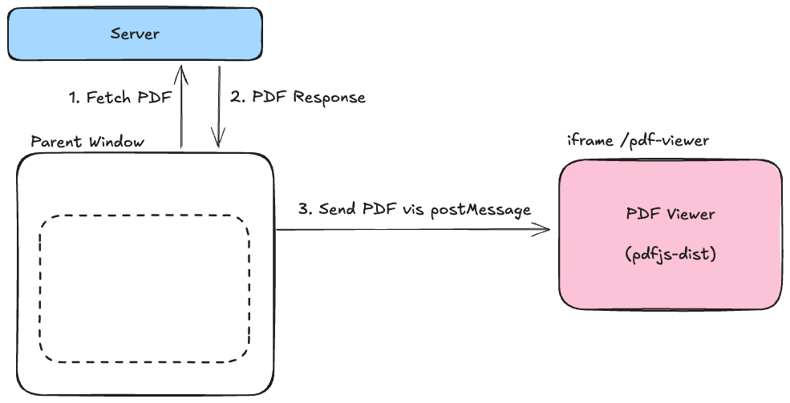
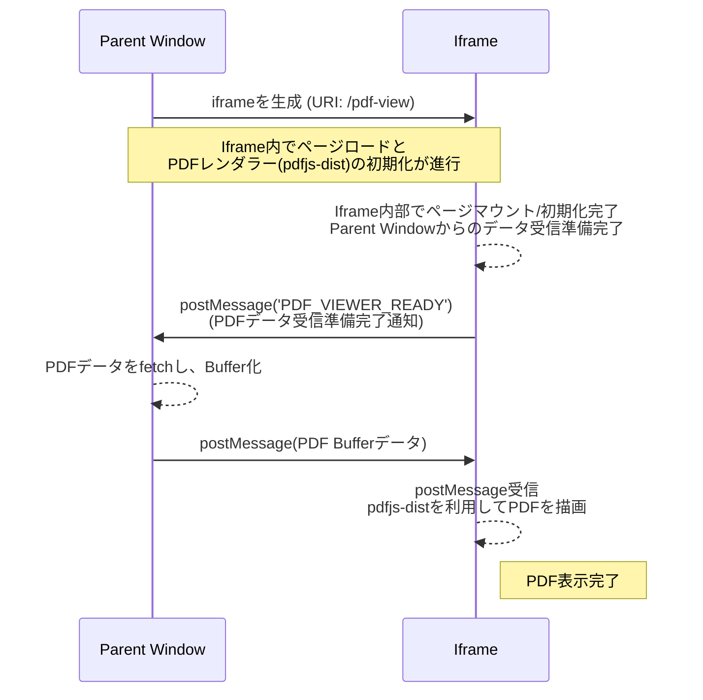

# React + pdfjs-dist + iframe

## 考察

### アーキテクチャの利点

- `iframe`内で pdfjs-dist を利用することで、HTML/CSS/JS のリソースを分離できる。
- Parent Window から`iframe`に対して PDF の情報を渡す際に`postMessage`を利用することで、PDF ビュワーのページの用途を限定できる。
  - postMessage で渡すことにより、PDF ビュワー内がステートレスになる。
  - クエリパラメーターや、LocalStorage などのユーザーが介入する方法がなく、PDF のデータが残らない。
- `iframe`で開くと、別プロセスで動作するためメモリ空間やレンダリングのコンテキストが分離される。

<!-- 以下生成AIによる考察。なお人間が目を通している。 -->

### パフォーマンス面

- **メモリ管理の利点**
  - iframe は独立したブラウジングコンテキストを持つため、PDF ビュワーを閉じる際に iframe を破棄することで、PDF 処理に使用されたメモリを確実に解放できる。
  - 親ウィンドウのメモリ空間とは分離されているため、大容量 PDF の処理が親アプリケーションのパフォーマンスに与える影響を最小限に抑えられる。
- **描画の分離**
  - PDF 描画処理が独立したレンダリングコンテキストで行われるため、親ウィンドウのレンダリングパフォーマンスに影響を与えにくい。

### セキュリティ面

- **Same-Origin Policy**
  - 同一オリジン内での iframe 利用により、`postMessage`による安全な通信が可能。
  - origin の検証を行うことで、意図しないウィンドウからのメッセージを拒否できる。
- **XSS 攻撃への耐性**
  - PDF データを URL パラメータや LocalStorage に保存しないため、XSS 攻撃によるデータ漏洩のリスクを低減させる。
  - PDF ビュワーがステートレスであるため、セッション間でデータが残存するリスクがない。
- **データの揮発性**
  - PDF データがメモリ上にのみ存在し、永続化されないため、機密性の高いドキュメントの表示に適している。

### 実装上の課題・トレードオフ

- **通信のオーバーヘッド**
  - `postMessage`を介したデータ転送には、構造化複製アルゴリズムによるシリアライズコストが発生する。
  - 大容量 PDF の場合、データ転送に時間がかかる可能性がある（ただし、Transferable Objects を利用することで軽減可能）。
- **デバッグの複雑性**
  - 親ウィンドウと iframe 間の非同期通信により、デバッグが通常の React アプリケーションより複雑になる。
  - 開発者ツールで iframe コンテキストを切り替える必要がある。
- **初期化タイミングの制御**
  - iframe の初期化完了を待つ必要があるため、`PDF_VIEWER_READY`のような準備完了通知の仕組みが必須。
  - レースコンディションを避けるための慎重な実装が必要。

### 適用場面・ユースケース

このアーキテクチャは以下のような場合に特に有効:

- **機密性の高いドキュメントの表示**
  - 医療記録、法的文書、金融情報など、表示後にデータを残したくない場合
- **マルチテナント SaaS**
  - 複数のユーザーが異なる PDF を閲覧する環境で、データの混在を防ぎたい場合
- **リソース管理が重要なアプリケーション**
  - 大量の PDF を順次表示する必要があり、メモリリークを避けたい場合
- **セキュリティ要件が厳しいエンタープライズアプリケーション**
  - PDF データの永続化を避け、監査要件を満たす必要がある場合

### 代替アプローチとの比較

| アプローチ                | メリット                                                                  | デメリット                                                                  |
| ------------------------- | ------------------------------------------------------------------------- | --------------------------------------------------------------------------- |
| **iframe 分離（本実装）** | ・リソース/メモリの完全な分離 ・データの揮発性 ・セキュリティの向上 | ・実装の複雑性 ・通信オーバーヘッド ・デバッグの難しさ                |
| **直接埋め込み**          | ・実装がシンプル ・デバッグが容易 ・通信オーバーヘッドなし          | ・メモリ管理が困難 ・リソースの分離ができない ・状態管理が複雑化      |
| **Web Worker 利用**       | ・UI スレッドをブロックしない ・並列処理が可能                         | ・DOM 操作ができない ・Canvas 描画は別途実装が必要 ・通信コストが高い |
| **別タブ/ウィンドウ**     | ・完全な分離 ・ブラウザの標準 PDF 表示を利用可能                       | ・UX が劣る ・タブ/ウィンドウ管理が必要 ・ユーザー操作に依存          |

## PDF 表示までのシーケンス図

## LICENCE

MIT
