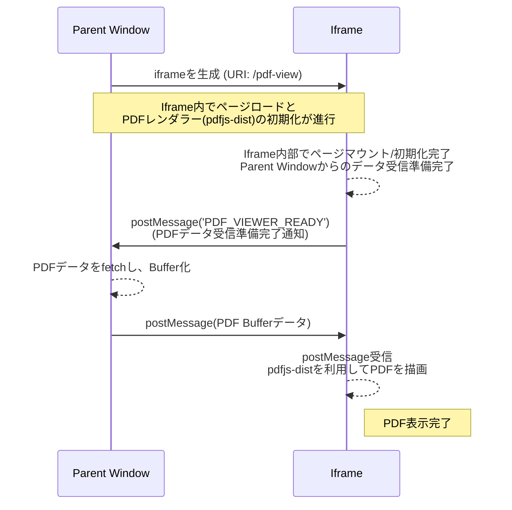

# React + pdfjs-dist + iframe

## PDF表示までのシーケンス図

```mermaid
sequenceDiagram
    participant P as Parent Window
    participant I as Iframe

    P->>I: iframeを生成 (URI: /pdf-view)
    Note over P,I: Iframe内でページロードと<br>PDFレンダラー(pdfjs-dist)の初期化が進行

    I-->>I: Iframe内部でページマウント/初期化完了<br>Parent Windowからのデータ受信準備完了

    I->>P: postMessage('PDF_VIEWER_READY')<br> (PDFデータ受信準備完了通知)

    P-->>P: PDFデータをfetchし、Buffer化

    P->>I:  postMessage(PDF Bufferデータ)

    I-->>I: postMessage受信<br>pdfjs-distを利用してPDFを描画
    Note right of I: PDF表示完了
```

## LICENCE

MIT
