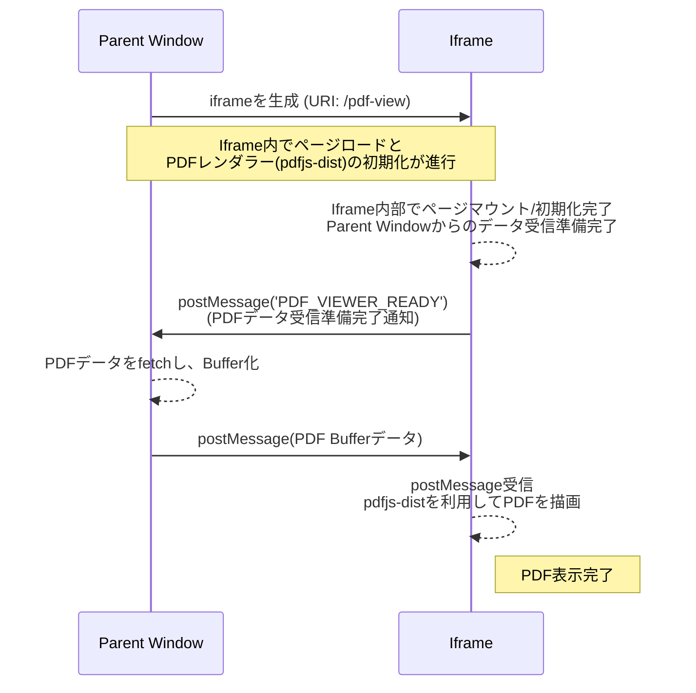

# React + pdfjs-dist + iframe


## What solve this ?

様々なプラットフォーム上のブラウザ で PDF をいかにして表示するかという課題を解く。

対象のプラットフォーム:

- Google Chrome
- Safari
- iOS / Safari
- iOS Webview (アプリ内)
- Android / Chrome
- Android Webview (アプリ内)

Response Header が以下の用なとき、ブラウザが**対応していれば**搭載されて入れる PDF ビュワーで 内容を表示してくれる。これがまぁ足並みが揃っていない。

```
Content-Type: application/pdf
Content-Disposition: inline; filename="awesome.pdf";
```

これを解決するうまい話がないか、というのが本題だ。

## 前提条件

大抵の PDF は機密情報が含まれていて、セキュアな環境で扱う必要がある。
PDF の取得には認証もしくは認可されたユーザーだけしか見れないし、クライアントの端末にダウンロードしてよいかどうかもまちまちだ。そのあたりを考えてアーキテクチャを構成するひつようがある。

## iframe + pdfjs の構成の考察

技術選定として外せない部分としては、PDF ビュワーは Web の技術（JS や WebWorker、wasm）等で表現する。
PDF ビュワーはポータビリティを考えてステートレスにする。このステートレスというのは、どこから PDF を取得するといった情報や、URL、クライアントストレージにソースとなる情報を持たせないという意味合いで使う。要は PDF ビュワーはなんの PDF を表示するのか知らん状態にしておく。

こうなると、

- PDF ビュワーをアプリケーション内部に組み込んでコンポーネント化する

が上がってくるわけだが、保守の観点から見ればアプリケーションに組み込みたくはない。
バッサリいえば内部実装のよくわからないライブラリを同居させることになるわけだし。
そうなってくると PDF ビュワーは独立したページかつバンドルを分ける、となってくるが、ステートレスにする、という観点から PDF ビュワーにどうやって PDF のデータを渡すか考えなければいけない。無論、base64 で URL に含めるとか持ってのほかだ（他のアルゴリズムでもだめ）。そこに機密情報があるじゃろう？

そうなってくると、このリポジトリで書いているような

- PDF は iframe の中で表示する。PDF のデータは親 window から PostMessage で送信する。

が想定されるアーキテクチャだろう。
大体このアーキテクチャになってくる所以は語っているのでまとめると、

- PDF ビュワーを`iframe`で提供することで HTML/CSS/JS などの実装をアプリケーション本体のコードから分離することができる。
- PDF のデータは PostMessage 経由のみでしか受け取らないようにすれば、PDF ビュワーは PDF がどこにあるのか知らなくても良い。

逆に、技術選定の中でこれは何でもいい、という自由な部分はあって、

- PDF ビュワーそのものがどのライブラリで作られているか（本リポジトリは`pdfjs-dist`だが、実際なんでもいい）
- React じゃなくてもいい。筆者が React を使うことが多いだけ。

### セキュリティ面

- **Same-Origin Policy**
  - 同一オリジン内での iframe 利用により、`postMessage`による安全な通信が可能。
  - origin の検証を行うことで、意図しないウィンドウからのメッセージを拒否できる。Cross-Origin にしたとしても同様。
- **XSS 攻撃への耐性**
  - PDF データを URL パラメータや LocalStorage に保存しないため、XSS 攻撃によるデータ漏洩のリスクを低減させる。
  - PDF ビュワーがステートレスであるため、セッション間でデータが残存するリスクがない。
- **データの揮発性**
  - PDF データがメモリ上にのみ存在し、永続化されないため、ステートレスに機密情報を扱える。

### 実装上の課題・トレードオフ

- **通信のオーバーヘッド**
  - `postMessage`を介したデータ転送には、構造化複製アルゴリズムによるシリアライズコストが発生する。
  - 大容量 PDF の場合、データ転送に時間がかかる可能性がある（ただし、[Transferable Objects](https://developer.mozilla.org/ja/docs/Web/API/Web_Workers_API/Transferable_objects) を利用することで軽減可能）。
- **初期化タイミングの制御**
  - iframe の初期化完了を待つ必要があるため、`PDF_VIEWER_READY`のような準備完了通知の仕組みが必須。
  - レースコンディションを避けるための慎重な実装が必要。（ステートマシンも検討）

## PDF をビュワーで表示するまでのシーケンス図



## LICENCE

MIT
